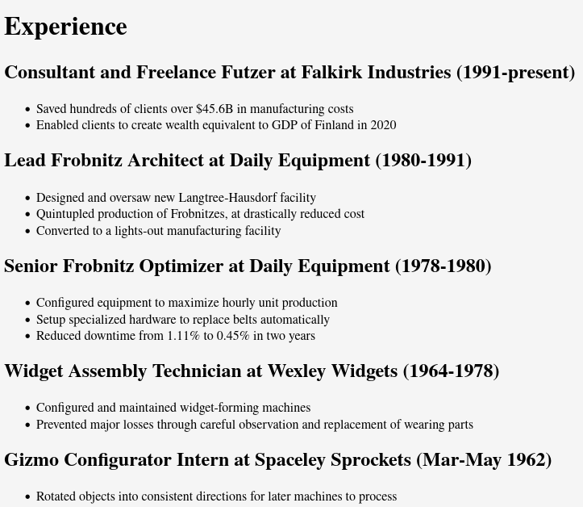

Congratulations on writing your first HTML document.

While you have achieved putting text on a page, that's only part of the battle, and it does need to look a bit more presentable than the default styles for people to take you seriously. This is not only literally art, it is also an art to build these styles in a way that works well at many zoom levels, for the disabled, on mobile devices, on huge projectors or on HiDPI screens. We're not covering any of that because in all likelihood, you will use a framework written by people who have thought about this longer than you.

We're just going to cover the bare bones:
* How to format text in usual ways, like bold, italic, underline, size, etc.
* How to create many kinds of boxes
* Ways to organize boxes into rows, columns, and grids

---

So in the last challenge I asked you to create your resume in HTML, because the formatting is pretty easy and it's a good place to start.

# An example document
Here's your document might look, which I'll reuse a few times:

```html
<!DOCTYPE html>
<html lang="en">
<!-- as a reminder, these are comments -->
<head>
    <!--
        Character set here refers to how the data is interpreted into letters/characters
        UTF-8 is the one and only standard here and you are supposed to mention it to
        confirm that you know that. In the nineties there were other standards and it was a mess.

        This is one of the only tags that does not have a matching end tag.
    -->
    <meta charset="UTF-8">

    <!-- This is the name that will shop up on the tab bar, window name, and in bookmarks -->
    <title>Fred Falkirk: Freelance Futzer</title>

    <!--
        This is to improve how it looks on a phone or tablet. When we get a little further along,
        feel free to take it out to see what a mess it looks like without this.
        It makes hardly any difference on a laptop or desktop.
    -->
    <meta name="viewport" content="width=device-width, initial-scale=1">
  
    <!--
        This links to the file with the styling and formatting rules we are going to apply
        to your document. Notice how it corresponds to a file in your codepen, if you built it that way.
    -->
    <link rel="stylesheet" href="styles/index.processed.css">
</head>
  
<body>
  
    <!--
        At this point you write whatever you want inside your document.
        I'll give some examples here
    -->

    <h1> Experience </h1>

    <h2> Consultant and Freelance Futzer at Falkirk Industries (1991-present) </h2>
    <ul>
        <li> Saved hundreds of clients over $45.6B in manufacturing costs </li>
        <li> Enabled clients to create wealth equivalent to GDP of Finland in 2020 </li>
    </ul>

    <h2> Lead Frobnitz Architect at Daily Equipment (1980-1991)</h2>
    <ul>
        <li> Designed and oversaw new Langtree-Hausdorf facility </li>
        <li> Quintupled production of Frobnitzes, at drastically reduced cost </li>
        <li> Converted to a lights-out manufacturing facility </li>
    </ul>

    <h2> Senior Frobnitz Optimizer at Daily Equipment (1978-1980)</h2>
    <ul>
        <li> Configured equipment to maximize hourly unit production </li>
        <li> Setup specialized hardware to replace belts automatically </li>
        <li> Reduced downtime from 1.11% to 0.45% in two years </li>
    </ul>

    <h2> Widget Assembly Technician at Wexley Widgets (1964-1978) </h2>
    <ul>
        <li> Configured and maintained widget-forming machines </li>
        <li> Prevented major losses through careful observation and replacement of wearing parts </li>
    </ul>

    <h2> Gizmo Configurator Intern at Spaceley Sprockets (Mar-May 1962) </h2>
    <ul>
        <li> Rotated objects into consistent directions for later machines to process </li>
        <li> Achieved high performance award, with over 1000 rotations in one hour </li>
    </ul>

    <h1> Education </h1>
    <h2> Associate of Science at Saltville Community College </h2>
    <ul>
        <li> 1962-1964 </li>
        <li> GPA 3.4 </li>
    </ul>

    <h1> Contact </h1>
    <p>
        0 Null Street,
        Missing, Alaska 00000
    </p>
    <p>
        000-555-0000 (mobile)
    </p>
    <p>
        000-555-0001 (fax)
    </p>
    <p>
        000-555-0002 (telegraph)
    </p>
    <!-- That seems like enough. Yours may be longer -->

    <!--
        This last part executes a script, which can maker your page animated
        or interactive. We will get to it way later.
        You could remove it or ignore it, your choice.
     -->
    <script src="scripts/index.js"></script>
</body>
</html>
```

# How to do better
What the code creates above obviously isn't anyone's idea of beautiful:


We change all that using style rules, which are remarkably simple for what they do, but you may find that hard to believe when you start. It basically all boils down to a few things:
1. You change properties of text and "stuff" using a very straightforward syntax like `color: green;`. There are unbelievably many properties you can change.
2. These come in groups that all get applied together, like: `{ color: green; font-size: x-large; }`
3. The groups have rules called "selectors" that choose what parts of the page they apply to, which look complex, but most of them are rare. These look like `.fancy` or `div.post a:hover`. We'll cover what they mean in a second.

When you put these together, you get a practical way to change a bunch of areas of the page in consistent ways, which is shockingly easy (in my opinion):
```css
/* This is a comment in CSS */

body {
    /* Make the text a tad more modern */
    font-family: sans-serif;
}
/* These are too large for me, scale it down */
h1 { font-size: 1.5rem; }
h2 { font-size: 1.2rem; }
/* Change both their colors */
h1, h2 { color: darkblue; }

/* I want the lists to look radically different */
li {
    /* No bullets */
    list-style-type: none;
    /* Semitransparent light gray background */
    background-color: rgba(0,0,0,0.05);
    /* Extra space around each item */
    padding: 0.3rem 1rem;
    /*
       Even more space (but this one has no background,
       so it will create white lines between items)
    */
    margin: 0.2rem 0;
    /* A thin gray line on the left side */
    border-left: 1px solid gray;
}
```
Try it out and you'll see how much better it looks already. The contact area looks pretty rough still, so see what you can do to make it look a little more professional using what you see here.

> Feel free to check out MDN for any HTML and CSS references you need.
> In particular, I think you will find the
> [CSS Selectors](https://developer.mozilla.org/en-US/docs/Web/CSS/CSS_Selectors)
> to be very helpful for this exercise,
> and I think the entire
> [Basic CSS Tutorial](https://developer.mozilla.org/en-US/docs/Learn/Getting_started_with_the_web/CSS_basics)
> would give you a great background for what's going on.

# The Boxes
Most elements in CSS are considered to be boxes, and you've already seen how I used `margin` (space outside the box), `border` (line around the box), and `padding` (space inside the box), and you'll find those three everywhere.
There are quite a few elements that are only used to create more boxes, like:

* `<div>`, meaning "division" and the most common multipurpose box.
* `<main>`, `<article>`, which by default are also essentially invisible, they are there mostly because their names convey different meaning.
* `<pre>` will create a box with teletyped monospace font inside it
* Feel free to search for others.

These boxes basically mean nothing until you name them and give them rules. There are several ways to do that but you almost always use a class. You tag an element with a class like this: `<div class="name">` and you can then apply rules to it with a leading dot in your selector: `.name { whatever }`. You can have multiple classes on a single box, `<div class="foo bar baz">` and you can apply a single class on as many boxes as you want: `<div class="foo"></div><div class="foo"></div>`.


# Organizing the page
There are about a dozen good ways to create the high-level layout of your page,
and probably the simplest is the CSS-Grid. You write out the names of the areas you want, in a literal grid, and then name the boxes you want to put there with those areas. To make this work, I'll show it for the top layer layout:

```css
body {
    /* This chooses that we want to control the layout as a grid */
    display: grid;
    /*
        This is how we want the grid to look visually:
        Two columns, two rows, and contact will span the whole top,
        while "edu" and "exp" will split the bottom.
        
        The names are totally made up but they have to be a single word with no spaces
    */
    grid-area-template: "contact contact"
                        "edu exp";
}
/*
    Here we match the grid areas to selectors.
    The grid area names are totally unrelated,
    so they can have the same or different names,
    but it means nothing until you make this rule to connect them.
*/
/*
    Here the selectors start with a dot.
    That means we are selecting by class.
*/
.contact { grid-area: contact; }
.education { grid-area: edu; }
.experience { grid-area: exp; }
```

> So as the last challenge for today, wrap the Education, Experience, and Contact areas of the page into boxes and tag them to move them to the areas you want in the layout.
> Then see if you can do the same inside Education to make the layout for the sections of Education more appealing as well.

This is not by any means all you can do with CSS Grid, so if you are trying to take this further, or if you want more detail on what you're doing, you'll find [MDN has more to say about it](https://developer.mozilla.org/en-US/docs/Web/CSS/CSS_Grid_Layout) but I think the best resource is probably [Grid by Example](https://gridbyexample.com/)
