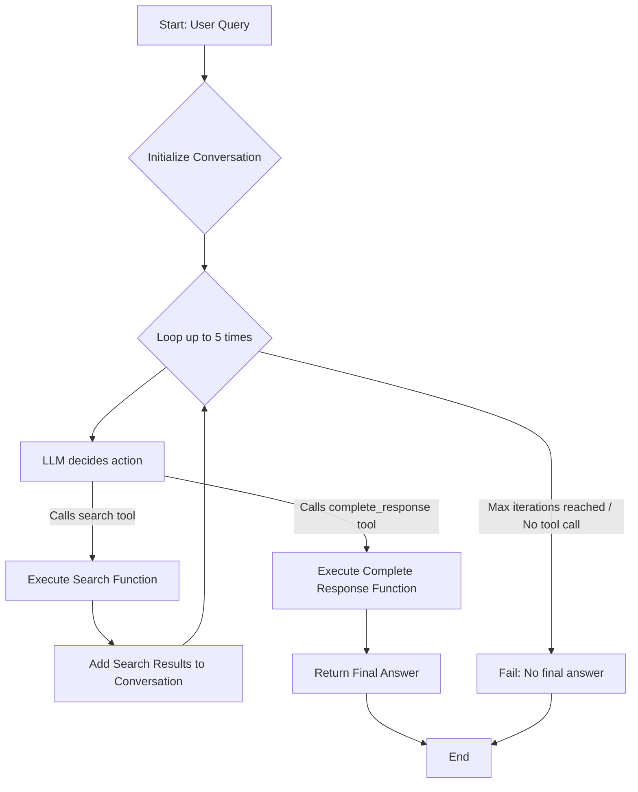

In a previous post, "[RAG Speedrun: From Zero to Retrieval-Augmented Generation in Python](https://seantater.github.io/python/llm/rag/2025/07/04/rag-speedrun.html)", we explored the fundamentals of Retrieval-Augmented Generation (RAG), demonstrating how to combine a knowledge base with a Large Language Model (LLM) to answer questions beyond the LLM's training data. The approach was straightforward: retrieve relevant information based on a user query, then pack that information into the LLM's prompt for generation.

While effective, this "query-first, then generate" approach has limitations. It assumes the initial query is sufficient for retrieval and that a single retrieval step is enough. What if the LLM needs to perform multiple searches, refine its query, or decide when it has enough information to answer? This is where **Agentic RAG** comes into play.

Agentic RAG empowers the LLM with the ability to interact with its environment by calling tools. Instead of a rigid, two-step process, the LLM becomes an agent that can decide *when* and *how* to retrieve information, and *when* to formulate a final response. This post will walk through the concept, implementation, and benefits of an Agentic RAG system.

## The Agentic RAG Plan

Our Agentic RAG system will operate as a loop, allowing the LLM to dynamically decide its next action. The core idea is to present the LLM with the user's query and a set of available functions (tools) it can call. The LLM will then choose to:

1.  **Perform a search**: If it needs more information, it will call a `search` function, providing a query for the search. The results of this search will be fed back to the LLM.
2.  **Complete the response**: If it believes it has sufficient information, it will call a `complete_response` function, providing its final answer.

This loop will continue for a maximum of 5 iterations to prevent infinite loops, failing if a final response isn't generated within this limit.

Here's a high-level flow:



## Code Segments

We'll build upon the `speedrun.py` script, reusing the document embeddings and the `retrieve_info` function. The main changes will be in how we interact with the LLM and orchestrate the RAG pipeline.

### 1. Setting up the Tools for the LLM

For the LLM to "know" about the functions it can call, we need to define them in a structured format that the OpenAI-compatible API understands.

```python
# Define tools for the LLM
tools = [
    {
        "type": "function",
        "function": {
            "name": "search",
            "description": "Searches the knowledge base for relevant information based on a query.",
            "parameters": {
                "type": "object",
                "properties": {
                    "query": {
                        "type": "string",
                        "description": "The search query to find relevant documents.",
                    },
                },
                "required": ["query"],
            },
        },
    },
    {
        "type": "function",
        "function": {
            "name": "complete_response",
            "description": "Provides the final answer to the user's question.",
            "parameters": {
                "type": "object",
                "properties": {
                    "answer": {
                        "type": "string",
                        "description": "The complete answer to the user's question.",
                    },
                },
                "required": ["answer"],
            },
        },
    },
]
```

### 2. The Agentic RAG Pipeline

This is the core of our agent. It will manage the conversation history, call the LLM, and execute tools based on the LLM's decisions.

```python
def agentic_rag_pipeline(user_query, max_iterations=5):
    """
    Orchestrates the Agentic RAG pipeline, allowing the LLM to use tools.
    """
    print(f"\n--- Processing Agentic Query: '{user_query}' ---")
    client = OpenAI(
        base_url="http://localhost:11434/v1",
        api_key="ollama",
    )
    model_name = "qwen3:4b"

    messages = [
        {"role": "system", "content": "You are a helpful assistant. You can search a knowledge base for information and provide a final answer. Use the 'search' tool if you need more information. Use the 'complete_response' tool when you have a complete answer to the user's question."},
        {"role": "user", "content": user_query}
    ]

    for i in range(max_iterations):
        print(f"\n--- Iteration {i+1}/{max_iterations} ---")
        print("Sending request to LLM...")
        try:
            response = client.chat.completions.create(
                model=model_name,
                messages=messages,
                tools=tools,
                tool_choice="auto", # Allow the LLM to choose whether to call a tool
                stream=False,
            )
        except Exception as e:
            print(f"Error during Ollama API call: {e}")
            print(f"Ensure Ollama is running and the '{model_name}' model is pulled (run 'ollama run {model_name}' in your terminal).")
            return "An error occurred during processing."

        response_message = response.choices[0].message
        messages.append(response_message) # Add LLM's response to messages

        if response_message.tool_calls:
            tool_call = response_message.tool_calls[0] # Assuming one tool call per turn for simplicity
            tool_name = tool_call.function.name
            tool_args = tool_call.function.arguments

            if tool_name == "search":
                query_for_search = json.loads(tool_args).get("query")
                print(f"LLM called 'search' with query: '{query_for_search}'")
                retrieved_chunks = retrieve_info(query_for_search)
                context_str = "\n".join(retrieved_chunks)
                print("\nRetrieved Context:")
                for j, chunk in enumerate(retrieved_chunks):
                    print(f"  {j+1}. {chunk}")

                messages.append(
                    {
                        "tool_call_id": tool_call.id,
                        "role": "tool",
                        "name": tool_name,
                        "content": context_str,
                    }
                )
            elif tool_name == "complete_response":
                final_answer = json.loads(tool_args).get("answer")
                print(f"LLM called 'complete_response' with answer:")
                print(final_answer)
                print("------------------------------------")
                return final_answer
            else:
                print(f"Unknown tool called: {tool_name}")
                return "An unexpected tool was called."
        else:
            # LLM provided a direct response without calling a tool
            print("LLM provided a direct response:")
            print(response_message.content)
            print("------------------------------------")
            return response_message.content

    print("Max iterations reached without a final answer.")
    return "Could not find a complete answer within the allowed iterations."
```

### 3. Integrating with Existing Components

We'll need to import `json` for parsing tool arguments and ensure our `retrieve_info` function is available. The `generate_response_with_ollama` function is no longer directly called by the pipeline but its core logic for interacting with Ollama is now embedded within the agentic loop's LLM calls.

## Complete Script

Here's the full script, combining the existing RAG setup with the new Agentic RAG pipeline.

```python
# /// script
# requires-python = ">=3.13"
# dependencies = [
#     "openai",
#     "sentence-transformers",
#     "torch",
# ]
#
# # The following section uses the CPU version of pytorch by default, since it is smaller and more portable,
# # but you can remove the lines below to use the Nvidia GPU version if you have a compatible GPU.
#
# [tool.uv.sources]
# torch = { index = "pytorch" }
#
# [[tool.uv.index]]
# name = "pytorch"
# url = "https://download.pytorch.org/whl/cpu"
# ///
import torch
from sentence_transformers import SentenceTransformer, util
from openai import OpenAI
import json # Added for parsing tool arguments

# 1. Define a small, in-memory knowledge base
documents = [
    "The company's annual 'Innovation Summit' is held every October in the virtual metaverse.",
    "Our new employee onboarding process requires completion of the 'Clarity Protocol' module within the first week.",
    "Project Nightingale's primary objective is to integrate AI-driven analytics into legacy systems by Q3.",
    "The best coffee machine in the office is located on the 7th floor, near the quantum computing lab.",
    "Employee benefits include unlimited access to the 'Mindfulness Pods' located on floors 3 and 5.",
    "The internal code review guidelines emphasize readability and a maximum of 80 characters per line.",
    "Our next team-building event will be a virtual escape room challenge on the last Friday of next month.",
    "The 'Quantum Leap' initiative aims to reduce computational overhead by 40% by the end of the fiscal year.",
    "For expense reports, all receipts must be submitted via the 'Nexus Portal' within 48 hours of the transaction.",
]

# 2. Load a pre-trained Sentence Transformer model
print("Loading Sentence Transformer model...")
model = SentenceTransformer('all-MiniLM-L6-v2')
print("Model loaded.")

# 3. Generate embeddings for the documents
print("Generating document embeddings...")
document_embeddings = model.encode(documents, convert_to_tensor=True)
print("Document embeddings generated.")

def retrieve_info(query, top_k=2):
    """
    Retrieves the top_k most relevant document chunks for a given query.
    """
    query_embedding = model.encode(query, convert_to_tensor=True)
    cosine_scores = util.cos_sim(query_embedding, document_embeddings)[0]
    top_results = torch.topk(cosine_scores, k=top_k)
    retrieved_chunks = [documents[idx] for idx in top_results.indices]
    return retrieved_chunks

# Define tools for the LLM
tools = [
    {
        "type": "function",
        "function": {
            "name": "search",
            "description": "Searches the knowledge base for relevant information based on a query.",
            "parameters": {
                "type": "object",
                "properties": {
                    "query": {
                        "type": "string",
                        "description": "The search query to find relevant documents.",
                    },
                },
                "required": ["query"],
            },
        },
    },
    {
        "type": "function",
        "function": {
            "name": "complete_response",
            "description": "Provides the final answer to the user's question.",
            "parameters": {
                "type": "object",
                "properties": {
                    "answer": {
                        "type": "string",
                        "description": "The complete answer to the user's question.",
                    },
                },
                "required": ["answer"],
            },
        },
    },
]

def agentic_rag_pipeline(user_query, max_iterations=5):
    """
    Orchestrates the Agentic RAG pipeline, allowing the LLM to use tools.
    """
    print(f"\n--- Processing Agentic Query: '{user_query}' ---")
    client = OpenAI(
        base_url="http://localhost:11434/v1",
        api_key="ollama",
    )
    model_name = "qwen3:4b" # Ensure you have this model pulled with 'ollama run qwen3:4b'

    messages = [
        {"role": "system", "content": "You are a helpful assistant. You can search a knowledge base for information and provide a final answer. Use the 'search' tool if you need more information. Use the 'complete_response' tool when you have a complete answer to the user's question."},
        {"role": "user", "content": user_query}
    ]

    for i in range(max_iterations):
        print(f"\n--- Iteration {i+1}/{max_iterations} ---")
        print("Sending request to LLM...")
        try:
            response = client.chat.completions.create(
                model=model_name,
                messages=messages,
                tools=tools,
                tool_choice="auto", # Allow the LLM to choose whether to call a tool
                stream=False,
            )
        except Exception as e:
            print(f"Error during Ollama API call: {e}")
            print(f"Ensure Ollama is running and the '{model_name}' model is pulled (run 'ollama run {model_name}' in your terminal).")
            return "An error occurred during processing."

        response_message = response.choices[0].message
        messages.append(response_message) # Add LLM's response to messages

        if response_message.tool_calls:
            tool_call = response_message.tool_calls[0] # Assuming one tool call per turn for simplicity
            tool_name = tool_call.function.name
            tool_args = tool_call.function.arguments

            if tool_name == "search":
                query_for_search = json.loads(tool_args).get("query")
                print(f"LLM called 'search' with query: '{query_for_search}'")
                retrieved_chunks = retrieve_info(query_for_search)
                context_str = "\n".join(retrieved_chunks)
                print("\nRetrieved Context:")
                for j, chunk in enumerate(retrieved_chunks):
                    print(f"  {j+1}. {chunk}")

                messages.append(
                    {
                        "tool_call_id": tool_call.id,
                        "role": "tool",
                        "name": tool_name,
                        "content": context_str,
                    }
                )
            elif tool_name == "complete_response":
                final_answer = json.loads(tool_args).get("answer")
                print(f"LLM called 'complete_response' with answer:")
                print(final_answer)
                print("------------------------------------")
                return final_answer
            else:
                print(f"Unknown tool called: {tool_name}")
                return "An unexpected tool was called."
        else:
            # LLM provided a direct response without calling a tool
            print("LLM provided a direct response:")
            print(response_message.content)
            print("------------------------------------")
            return response_message.content

    print("Max iterations reached without a final answer.")
    return "Could not find a complete answer within the allowed iterations."

if __name__ == "__main__":
    # Example queries
    print("\n--- Running Agentic RAG Examples ---")
    agentic_rag_pipeline("When is the Innovation Summit held?")
    agentic_rag_pipeline("What is the Clarity Protocol?")
    agentic_rag_pipeline("Where can I find the best coffee machine?")
    agentic_rag_pipeline("What is the company's favorite animal?") # Query outside the context
    agentic_rag_pipeline("Tell me about the 'Quantum Leap' initiative and the 'Nexus Portal'.") # Multi-step query
